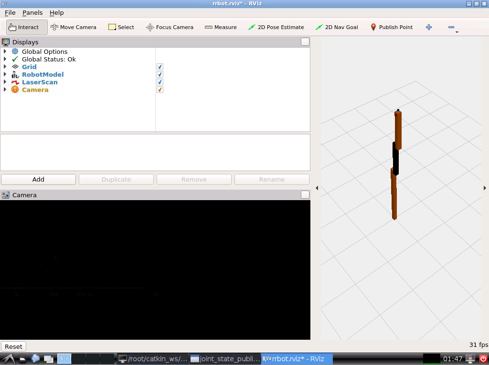
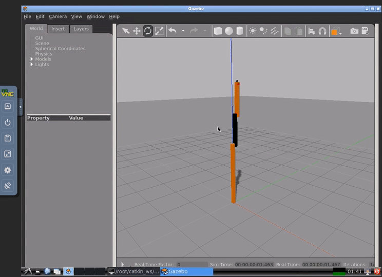

docker-ubuntu-vnc-ros
=====================

<!--
[](https://hub.docker.com/r/dorowu/ubuntu-desktop-lxde-vnc/)
[](https://hub.docker.com/r/dorowu/ubuntu-desktop-lxde-vnc/)
-->

Docker image to provide HTML5 VNC interface to access Ubuntu 16.04 LXDE desktop environment and ROS full desktop.
This imaeg is absed on [fcwu/docker-ubuntu-vnc-desktop](https://github.com/fcwu/docker-ubuntu-vnc-desktop) and
[osrf/ros:kinetic-desktop-full](https://hub.docker.com/r/osrf/ros).

Quick Start
-------------------------

Build docker image

```
$ git clone https://github.com/ikeyasu/docker-ubuntu-vnc-ros.git
$ cd docker-ubuntu-vnc-ros
$ docker build --rm -t ikeyasu/ubuntu-vnc-ros kinetic
```

Run the docker image and open port `6080`

```
docker run -it --rm -p 6080:80 ikeyasu/ubuntu--vnc-ros:kinetic
```

Browse http://127.0.0.1:6080/

Try gazebo

```
$ mkdir -p ~/catkin_ws/src
$ cd ~/catkin_ws/src/
$ git clone https://github.com/ros-simulation/gazebo_ros_demos
$ cd ../
$ catkin_make
$ roslaunch rrbot_description rrbot_rviz.launch
```

You can see



```
$ roslaunch rrbot_gazebo rrbot_world.launch
```



Connect with VNC Viewer and protect by VNC Password
------------------

Forward VNC service port 5900 to host by

```
docker run -it --rm -p 6080:80 -p 5900:5900 dorowu/ubuntu-desktop-lxde-vnc
```

Now, open the vnc viewer and connect to port 5900. If you would like to protect vnc service by password, set environment variable `VNC_PASSWORD`, for example

```
docker run -it --rm -p 6080:80 -p 5900:5900 -e VNC_PASSWORD=mypassword dorowu/ubuntu-desktop-lxde-vnc
```

A prompt will ask password either in the browser or vnc viewer.


Troubleshooting and FAQ
==================

1. boot2docker connection issue, https://github.com/fcwu/docker-ubuntu-vnc-desktop/issues/2
2. Screen resolution is fitted to browser's window size when first connecting to the desktop. If you would like to change resolution, you have to re-create the container


License
==================

See the LICENSE file for details.
